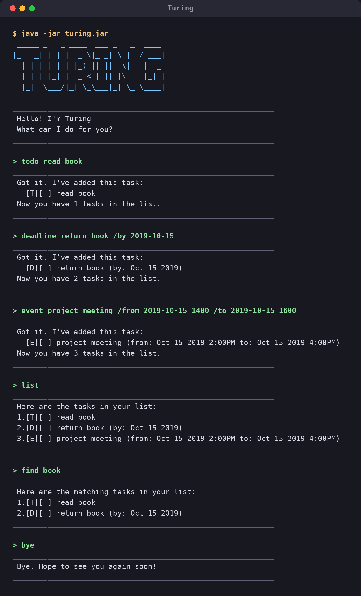

# Turing User Guide

Turing is a task-tracking chatbot that lives in your terminal. Tell it what you
have to do and it keeps the list for you: plain **todos**, **deadlines** that
are due by a certain date, and **events** that run from one time to another.
It saves the list automatically, so everything is still there the next time you
start it.

If you can type, you already know how to use it.



## Quick start

1. Make sure you have **Java 25** or later. Check with `java -version`.
2. Download `turing.jar` from the
   [latest release](https://github.com/ranoot/ip/releases).
3. Put the file in the folder you want Turing to keep your task list in.
4. Open a terminal in that folder and start the chatbot:

   ```
   java -jar turing.jar
   ```

5. Type a command, press Enter, and Turing replies. Try `todo read book`.
6. Type `bye` to leave. Your tasks are saved for you — see
   [Saving your tasks](#saving-your-tasks).

## Reading a task

Turing shows every task in the same shape: `[type][status] description`.

| Mark | Meaning |
| --- | --- |
| `[T]` | A todo — something to do, with no date attached |
| `[D]` | A deadline — something due by a certain time |
| `[E]` | An event — something that runs from a start to an end |
| `[X]` | Done |
| `[ ]` | Not done yet |

So `2.[D][X] return book (by: Oct 15 2019)` is the second task in your list: a
deadline, already done, due on 15 October 2019.

The number in front is the **task number**. It is what you quote to `mark`,
`unmark` and `delete`, and it always starts at 1.

## Writing dates and times

Write a date as `yyyy-MM-dd`, and add a 24-hour time as `HHmm` if you need one:

| You type | Turing shows |
| --- | --- |
| `2019-10-15` | `Oct 15 2019` |
| `2019-10-15 1800` | `Oct 15 2019 6:00PM` |

You are not obliged to use real dates. Anything else you write is kept exactly
as you typed it, so `/by Sunday` or `/by next Friday` is perfectly fine — a
reminder in your own words is still worth keeping. The one thing such a task
gives up is being found by the [`on`](#seeing-what-a-day-holds-on) command,
which needs a real date to look for.

## Features

A few things that hold for every command:

* Words in `UPPER_CASE` are the parts **you** supply. In
  `mark TASK_NUMBER`, `mark 2` is what you actually type.
* Command words are **not** case sensitive, and neither are `/by`, `/from` and
  `/to`. `BYE`, `Bye` and `bye` all say goodbye.
* Extra spaces are ignored, so `  mark    2 ` works just as well as `mark 2`.
* In the examples below, Turing's replies are shown without the horizontal
  divider lines that frame them on screen.

### Adding a todo: `todo`

Adds something to do, with no date attached.

Format: `todo DESCRIPTION`

Example: `todo read book`

```
Got it. I've added this task:
  [T][ ] read book
Now you have 1 tasks in the list.
```

### Adding a deadline: `deadline`

Adds something that is due by a certain time.

Format: `deadline DESCRIPTION /by WHEN`

Examples:

* `deadline return book /by 2019-10-15`
* `deadline submit report /by next Friday`

```
Got it. I've added this task:
  [D][ ] return book (by: Oct 15 2019)
Now you have 2 tasks in the list.
```

### Adding an event: `event`

Adds something that runs from a start to an end.

Format: `event DESCRIPTION /from START /to END`

Example: `event project meeting /from 2019-10-15 1400 /to 2019-10-15 1600`

```
Got it. I've added this task:
  [E][ ] project meeting (from: Oct 15 2019 2:00PM to: Oct 15 2019 4:00PM)
Now you have 3 tasks in the list.
```

### Listing everything: `list`

Shows every task you have, in the order you added them.

Format: `list`

```
Here are the tasks in your list:
1.[T][ ] read book
2.[D][ ] return book (by: Oct 15 2019)
3.[E][ ] project meeting (from: Oct 15 2019 2:00PM to: Oct 15 2019 4:00PM)
```

### Marking a task as done: `mark`

Format: `mark TASK_NUMBER`

Example: `mark 1`

```
Nice! I've marked this task as done:
  [T][X] read book
```

### Marking a task as not done: `unmark`

Changed your mind, or marked the wrong one? `unmark` puts it back.

Format: `unmark TASK_NUMBER`

Example: `unmark 1`

```
OK, I've marked this task as not done yet:
  [T][ ] read book
```

### Finding tasks by description: `find`

Shows every task whose description contains the text you give. Capitalization
does not matter, and part of a word is enough: `find boo` turns up
`read book` too.

Format: `find TEXT`

Example: `find BOOK`

```
Here are the matching tasks in your list:
1.[T][ ] read book
2.[D][ ] return book (by: Oct 15 2019)
```

The matches are numbered from 1 as a list of their own. To act on one of them,
run `list` first and use the number you see there.

### Seeing what a day holds: `on`

Shows everything that falls on one particular day: deadlines due that day, and
events running over it. An event counts for **every** day it spans, so a
conference from Monday to Thursday also shows up on the Wednesday.

Format: `on DATE`, where `DATE` is written as `yyyy-MM-dd`.

Example: `on 2019-10-15`

```
Here is what you have on Oct 15 2019:
1.[D][ ] return book (by: Oct 15 2019)
2.[E][ ] project meeting (from: Oct 15 2019 2:00PM to: Oct 15 2019 4:00PM)
```

Unlike the date on a task, this one has to be a real date — there is nothing to
look for otherwise. Tasks whose date you wrote in your own words, such as
`/by next Friday`, are not matched by `on`.

### Deleting a task: `delete`

Removes a task for good.

Format: `delete TASK_NUMBER`

Example: `delete 3`

```
Noted. I've removed this task:
  [E][ ] project meeting (from: Oct 15 2019 2:00PM to: Oct 15 2019 4:00PM)
Now you have 2 tasks in the list.
```

Everything below the deleted task moves up a number, so run `list` before your
next `mark` or `delete`.

### Leaving: `bye`

Format: `bye`

```
Bye. Hope to see you again soon!
```

### Saving your tasks

There is no save command: Turing writes your list to disk every time it
changes. Start it again and it picks up where you left off.

```
Welcome back. I remembered 3 tasks from last time.
```

The list lives in a plain text file at `data/turing.txt`, **relative to the
folder you started Turing from** — not to wherever `turing.jar` happens to sit.
Start it from the same folder each time and your tasks will be waiting.

### Editing the save file

The save file is ordinary text, one task per line, so you can edit or back it
up with any editor:

```
T | 0 | read book
D | 0 | return book | 2019-10-15
D | 0 | submit report | next Friday
```

The fields are the type (`T`, `D` or `E`), whether it is done (`1`) or not
(`0`), the description, and then the date or dates the task carries.

> **Careful:** if a line does not make sense, Turing leaves it out rather than
> giving up on the whole file, and tells you how many it skipped. Those tasks
> are then gone the next time the file is written. Back the file up before
> editing it by hand.

## When something goes wrong

Turing never crashes on a typo. It says what it did not understand and reminds
you of the right shape, then carries on waiting for your next command:

```
Sorry, I don't know what "blah" means.
Try one of: todo, deadline, event, list, find, on, mark, unmark, delete, bye.
```

```
A deadline needs a task and a due date, separated by /by.
Please use: deadline <task> /by <when>, e.g. deadline return book /by 2019-10-15
```

```
There is no task 99 in your list.
Please pick a number from 1 to 3, or type list to see them.
```

## FAQ

**Can I move my tasks to another computer?**
Yes — copy `data/turing.txt` into the folder you run Turing from on the other
machine.

**Does `find` search dates as well as descriptions?**
No, it searches descriptions only. Use `on` to search by date.

**Do I have to write dates as `yyyy-MM-dd`?**
Only for the `on` command. Everywhere else you can write a date however you
like — Turing understands `2019-10-15` and dresses it up as `Oct 15 2019`, and
keeps anything else exactly as you wrote it.

**What happens if I close the window instead of typing `bye`?**
Nothing is lost. Your list is written to disk after every change, not on the
way out.

## Command summary

| Action | Format | Example |
| --- | --- | --- |
| **Add a todo** | `todo DESCRIPTION` | `todo read book` |
| **Add a deadline** | `deadline DESCRIPTION /by WHEN` | `deadline return book /by 2019-10-15` |
| **Add an event** | `event DESCRIPTION /from START /to END` | `event meeting /from 2019-10-15 1400 /to 2019-10-15 1600` |
| **List everything** | `list` | `list` |
| **Find by description** | `find TEXT` | `find book` |
| **See one day** | `on DATE` | `on 2019-10-15` |
| **Mark as done** | `mark TASK_NUMBER` | `mark 2` |
| **Mark as not done** | `unmark TASK_NUMBER` | `unmark 2` |
| **Delete** | `delete TASK_NUMBER` | `delete 2` |
| **Exit** | `bye` | `bye` |
